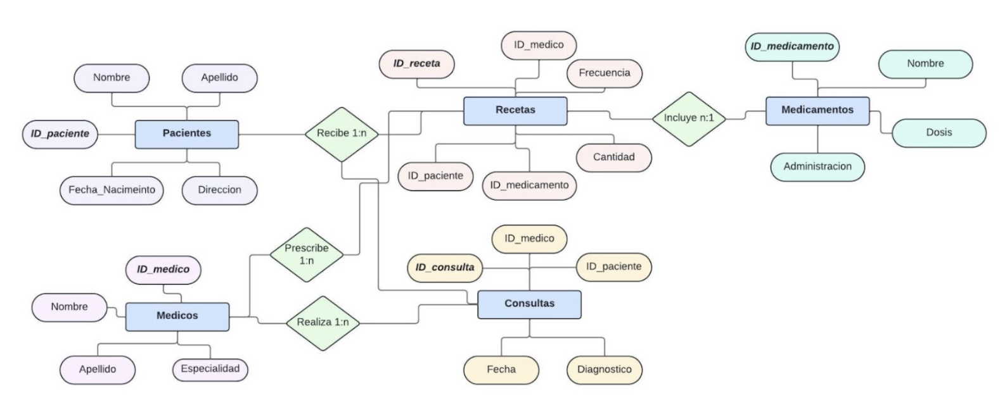
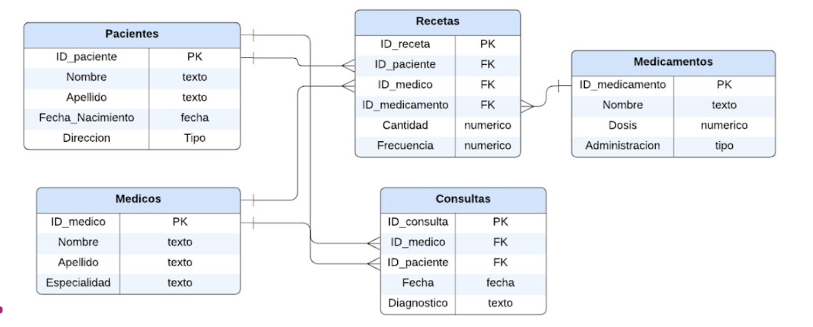
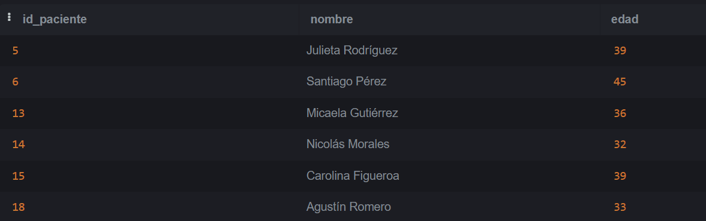
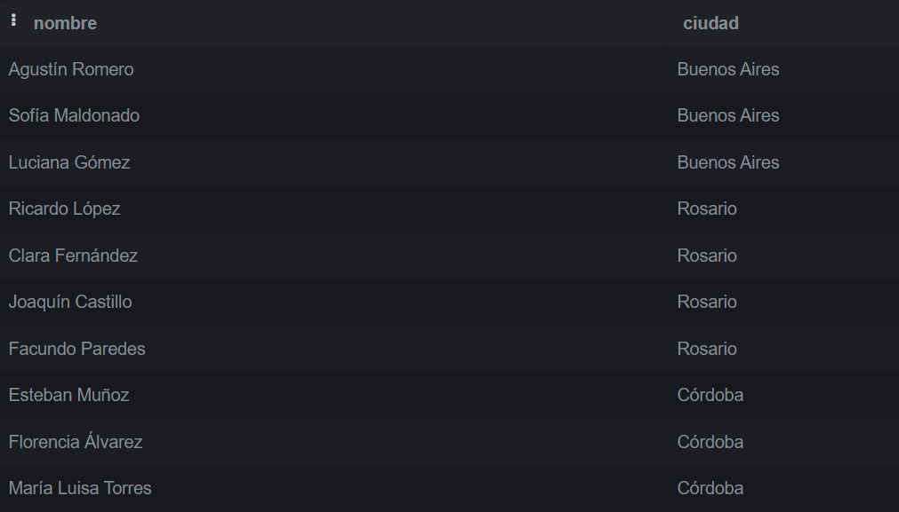
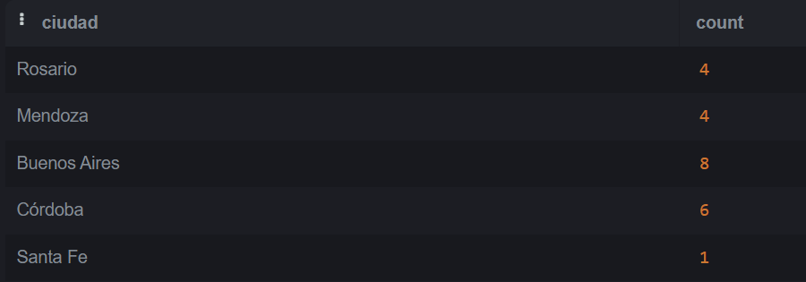
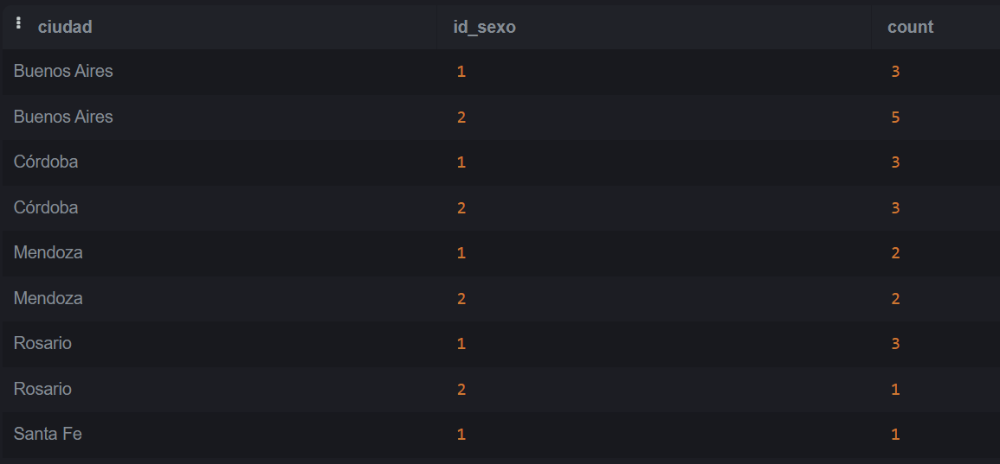
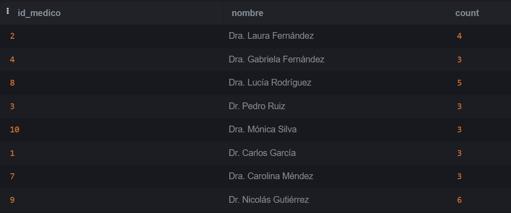

# Parte 1

## ¿Qué tipo de base de datos es? Clasificarla según estructura y función.

Según la clasificación de estructura la base de datos es relacional dado que la información almacenada es en forma de tablas y organizadas 
por relaciones entre distintas entidades como pacientes, médicos, recetas, etc. Por otro lado según la clasificación por función esta base 
de datos es transicional u operacional dado que se busca manejar y proporcionar los datos de la manera más eficiente y segura posible para 
las operaciones diarias de un centro médico.

## Armar el diagrama entidad-relación de la base de datos dada.



## Armar el Modelo relacional de la base de datos dada.



## ¿Considera que la base de datos está normalizada? En caso que no lo esté, ¿cómo podría hacerlo? Nota: no debe normalizar la base de datos, solo explicar como lo haría.

La normalización de una base de datos consiste en organizar la base de datos de acuerdo con una serie de reglas para eliminar redundancias 
y asegurar la consistencia de datos. En base  a los diagramas presentados en los puntos anteriores se puede observar que cada tabla presenta 
una clave primaria única y todas las demás columnas no clave dependen de esa clave primaria. Se puede ver que no hay dependencias transitivas 
visibles. Por estas razones consideramos que no se requiere ningún tipo de normalización adicional.

# Parte 2

## Ejercicio 1

```sql
CREATE INDEX idx_ciudad
ON pacientes(ciudad)
```


## Ejercicio 2

```sql
CREATE VIEW edad_paciente AS
SELECT
    id_paciente,
    nombre,
    EXTRACT(YEAR FROM AGE(CURRENT_DATE, fecha_nacimiento)) AS edad
    FROM pacientes
```


## Ejercicio 3

```sql
UPDATE pacientes
SET numero = 500, calle = 'Calle Corrientes'
WHERE nombre = 'Luciana Gómez'
```


## Ejercicio 4

```sql
SELECT nombre, matricula
FROM medicos
WHERE especialidad_id = 4
```


## Ejercicio 5

```sql
UPDATE pacientes
SET ciudad = 'Buenos Aires'
WHERE similarity(ciudad, 'Buenos Aires') > 0.4;

UPDATE pacientes
SET ciudad = 'Rosario'
WHERE similarity(ciudad, 'Rosario') > 0.4;

UPDATE pacientes
SET ciudad = 'Córdoba'
WHERE similarity(ciudad, 'Córdoba') > 0.3;

UPDATE pacientes
SET ciudad = 'Santa Fe'
WHERE similarity(ciudad, 'Santa Fe') > 0.4;

UPDATE pacientes
SET ciudad = 'Mendoza'
WHERE similarity(ciudad, 'Mendoza') > 0.3;
```


## Ejercicio 6

```sql
SELECT nombre, calle, numero
From pacientes
WHERE ciudad = 'Buenos Aires'
```


## Ejercicio 7

```sql
SELECT ciudad, count(*)
from pacientes
group by ciudad
```


## Ejercicio 8

```sql
SELECT ciudad, id_sexo, count(*)
from pacientes
group by ciudad, id_sexo
ORDER BY ciudad, id_sexo;
```


## Ejercicio 9

```sql
SELECT recetas.id_medico, medicos.nombre, count(recetas)
from recetas
inner join medicos
on recetas.id_medico = medicos.id_medico
group by recetas.id_medico, medicos.nombre;
```


## Ejercicio 10

```sql
SELECT id_consulta, fecha, id_medico
from consultas
where extract(year from fecha) = 2024
	and extract(month from fecha) = 8
	and id_medico = 3
group by id_consulta;
```


## Ejercicio 11

```sql
SELECT 
    P.nombre AS nombre_paciente,
    C.fecha,
    C.diagnostico
FROM 
    Consultas C
JOIN 
    Pacientes P ON C.id_paciente = P.id_paciente
WHERE 
    C.fecha >= '2024-08-01' AND C.fecha < '2024-09-01';
```


## Ejercicio 12

```sql
SELECT 
    M.nombre AS nombre_medicamento,
    COUNT(R.id_receta) AS total_prescripciones
FROM 
    Recetas R
JOIN 
    Medicamentos M ON R.id_medicamento = M.id_medicamento
WHERE 
    R.id_medico = 2
GROUP BY 
    M.id_medicamento;
```


## Ejercicio 13

```sql
SELECT 
    P.nombre AS nombre_paciente,
    COUNT(R.id_receta) AS total_recetas
FROM 
    Pacientes P
LEFT JOIN 
    Recetas R ON P.id_paciente = R.id_paciente
GROUP BY 
    P.id_paciente;
```


## Ejercicio 14

```sql
SELECT 
    M.nombre AS nombre_medicamento,
    COUNT(R.id_receta) AS total_recetas
FROM 
    Recetas R
JOIN 
    Medicamentos M ON R.id_medicamento = M.id_medicamento
GROUP BY 
    M.id_medicamento
ORDER BY 
    total_recetas DESC
LIMIT 1;
```


## Ejercicio 15

```sql
SELECT 
    P.nombre AS nombre_paciente,
    C.fecha AS fecha_ultima_consulta,
    C.diagnostico
FROM 
    Pacientes P
JOIN 
    Consultas C ON P.id_paciente = C.id_paciente
WHERE 
    C.fecha = (
        SELECT 
            MAX(fecha) 
        FROM 
            Consultas C2 
        WHERE 
            C2.id_paciente = P.id_paciente
    );
```


## Ejercicio 16

```sql
SELECT 
    M.nombre AS nombre_medico,
    P.nombre AS nombre_paciente,
    COUNT(C.id_consulta) AS total_consultas
FROM 
    Medicos M
JOIN 
    Consultas C ON M.id_medico = C.id_medico
JOIN 
    Pacientes P ON C.id_paciente = P.id_paciente
GROUP BY 
    M.id_medico, P.id_paciente
ORDER BY 
    M.nombre, P.nombre;
```


## Ejercicio 17

```sql
SELECT 
    M.nombre AS nombre_medicamento,
    COUNT(R.id_receta) AS total_recetas,
    Med.nombre AS nombre_medico,
    P.nombre AS nombre_paciente
FROM 
    Recetas R
JOIN 
    Medicamentos M ON R.id_medicamento = M.id_medicamento
JOIN 
    Medicos Med ON R.id_medico = Med.id_medico
JOIN 
    Pacientes P ON R.id_paciente = P.id_paciente
GROUP BY 
    M.id_medicamento, Med.id_medico, P.id_paciente
ORDER BY 
    total_recetas DESC;
```


## Ejercicio 18

```sql
SELECT 
    M.nombre AS nombre_medico,
    COUNT(DISTINCT C.id_paciente) AS total_pacientes
FROM 
    Medicos M
JOIN 
    Consultas C ON M.id_medico = C.id_medico
GROUP BY 
    M.id_medico
ORDER BY 
    total_pacientes DESC;
```

